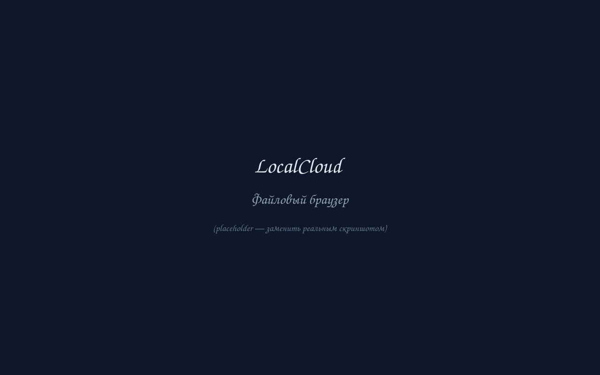
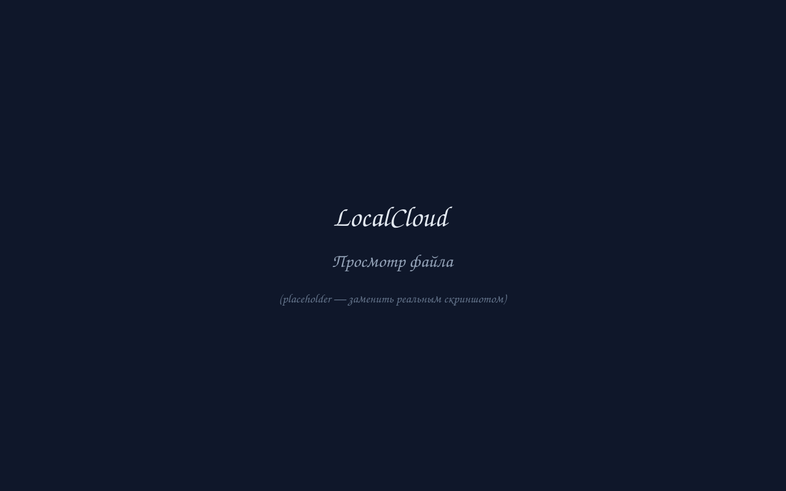
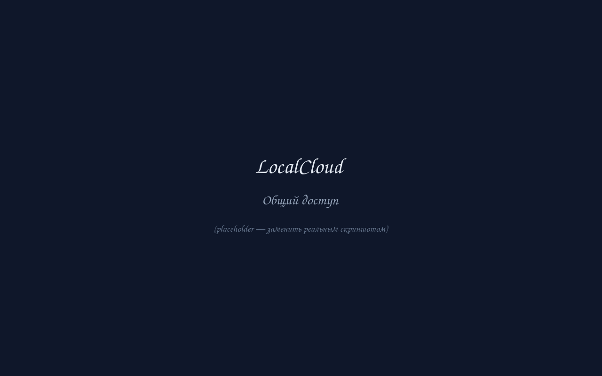
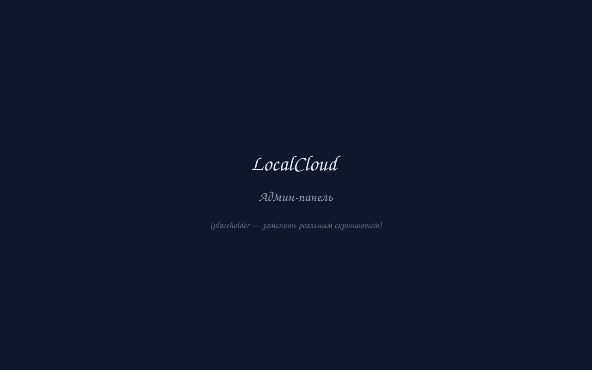
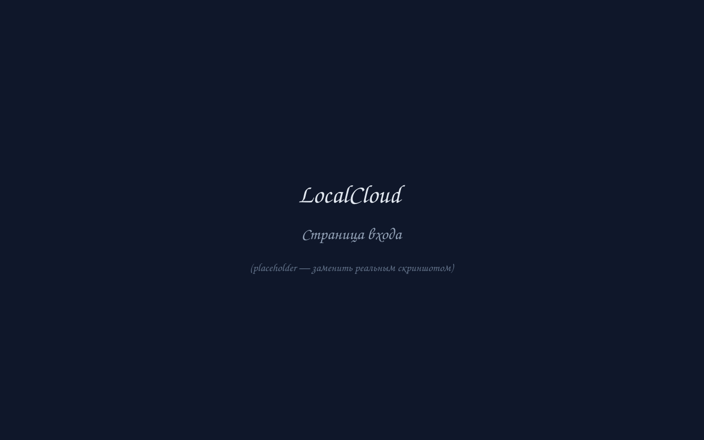
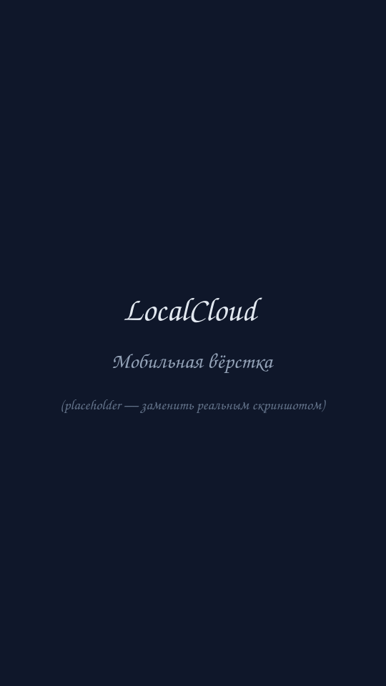

# LocalCloud

**Self-hosted облачное хранилище файлов** — приватная альтернатива Google Drive /
Dropbox, разворачиваемая на собственном сервере. Загрузка больших файлов
напрямую в объектное хранилище, папки с произвольной вложенностью, корзина,
общий доступ по ссылкам и пользователям, фоновая упаковка в ZIP, превью, квоты и
админ-панель.

> Рассчитан на небольшие команды. Стек запускается «из коробки» даже на слабом
> хосте (**1 CPU / 1 ГБ ОЗУ, ~3 пользователя**) и масштабируется конфигурацией
> под более мощный сервер — см. [подбор `.env`](#конфигурация-env).

---

## Содержание

- [Возможности](#возможности)
- [Скриншоты](#скриншоты)
- [Архитектура](#архитектура)
- [Стек](#стек)
- [Структура репозитория](#структура-репозитория)
- [Быстрый старт (Docker)](#быстрый-старт-docker)
- [Тесты](#тесты)
- [Развёртывание в production](#развёртывание-в-production)
- [Резервное копирование и восстановление](#резервное-копирование-и-восстановление)
- [Конфигурация .env](#конфигурация-env)
- [Локальная разработка](#локальная-разработка-без-docker)
- [Учётная запись по умолчанию](#учётная-запись-по-умолчанию)
- [Безопасность перед публикацией](#безопасность-перед-публикацией)
- [API](#api)
- [Документация](#документация)

---

## Возможности

- 📁 **Файлы и папки** — древовидная структура произвольной вложенности;
  перемещение, переименование, копирование, массовые операции.
- ⬆️ **Многочастичная загрузка** — клиент пишет части напрямую в MinIO/S3 по
  presigned-URL; backend лишь координирует сессию и не проксирует файловый трафик.
- ⬇️ **Скачивание архивами** — папки и произвольные наборы элементов
  упаковываются в ZIP фоновым worker'ом и отдаются по временной ссылке.
- 🗑️ **Корзина** — мягкое удаление с восстановлением и автоочисткой по расписанию.
- 🔗 **Публичные ссылки** — общий доступ к файлам/папкам: срок действия, пароль,
  загрузка в общую папку, скачивание архива.
- 👥 **Доступ между пользователями** — гранулярные права (read / download / write
  / delete / owner) на узлы с наследованием от родительских папок; вкладка
  «Доступно мне».
- 📊 **Квоты** — лимиты объёма и активных сессий загрузки; учёт ёмкости сервера.
- 🖼️ **Превью** — миниатюры изображений, PDF и видео генерируются фоновым
  worker'ом; лимиты и качество настраиваются (можно отключить на слабом хосте).
- 👤 **Аутентификация** — JWT в httpOnly-cookie, silent-refresh, регистрация по
  заявке с одобрением администратором, роли `admin`/`user`.
- 🛠️ **Админ-панель** — пользователи, заявки на регистрацию, журнал аудита,
  фоновые задачи.
- 🎛️ **Флаги функциональности** — превью/просмотр/проигрывание/редактирование
  включаются и отключаются через конфигурацию (для слабых серверов).
- 📱 **Адаптивный интерфейс** — тёмная/светлая тема, мобильная вёрстка.

---

## Скриншоты

| Файловый браузер | Просмотр файла |
|---|---|
|  |  |

| Общий доступ | Админ-панель |
|---|---|
|  |  |

| Вход | Мобильная вёрстка |
|---|---|
|  |  |

> Скриншоты лежат в [`docs/screenshots/`](docs/screenshots/). Интерфейс
> поддерживает тёмную и светлую темы — на снимках показана тёмная.

---

## Архитектура

```
┌──────────────┐    presigned PUT / GET     ┌──────────────┐
│   Браузер    │ ─────────────────────────► │  MinIO / S3  │
│ (React SPA)  │ ◄───────────────────────── │  (объекты)   │
└──────┬───────┘                            └──────▲───────┘
       │ REST  /api/v1                             │
       ▼                                           │ presign / put / get
┌──────────────┐      asyncpg        ┌──────────────┐
│   FastAPI    │ ──────────────────► │  PostgreSQL  │
│  (API)       │ ◄────────────────── │  (метаданные)│
└──────┬───────┘                     └──────▲───────┘
       │ ставит задачи (таблица tasks)      │
       ▼                                    │
┌──────────────┐                            │
│ Worker-проц. │ ───────────────────────────┘
│ (архивы,     │   читает объекты, строит ZIP,
│  превью,     │   чистит истёкшие сессии, превью,
│  очистка)    │   квоты, целостность хранилища
└──────────────┘
```

- **Backend (FastAPI)** координирует загрузку/скачивание, хранит метаданные в
  PostgreSQL и ставит фоновые задачи. Файловый трафик идёт мимо него — напрямую
  между браузером и хранилищем по presigned-URL.
- **Worker** — отдельный процесс, разбирающий очередь задач в таблице `tasks`
  (архивы, генерация превью, очистка истёкших сессий/ссылок/корзины, пересчёт
  квот, проверка целостности).
- **Frontend** — SPA на React, общается с backend по `/api/v1`, а с хранилищем —
  по presigned-URL.
- **nginx** — единая точка входа: один origin (`http://localhost`) обслуживает
  SPA, `/api` и bucket-пути MinIO, поэтому CORS не нужен.

---

## Стек

| Слой | Технологии |
|---|---|
| **Frontend** | React 19, TypeScript 6, Vite 8, React Router 7, TanStack Query 5, TanStack Virtual, Tailwind CSS v4, Radix UI / shadcn, Axios, lucide-react, Sonner |
| **Backend** | Python 3.13+, FastAPI, SQLAlchemy 2 (async) + asyncpg, Pydantic v2 / pydantic-settings, Alembic, python-jose (JWT), passlib (bcrypt/argon2), Pillow + PyMuPDF + ffmpeg (превью), MinIO SDK |
| **Хранилище** | PostgreSQL 16 (метаданные), MinIO / S3-совместимое (объекты) |
| **Инфраструктура** | Docker Compose (6 сервисов), nginx (шлюз + SPA), `uv` (Python), `npm`, `ruff` (lint), ESLint + Prettier, pytest, vitest |

---

## Структура репозитория

```
LocalCloud/
├── backend/             FastAPI API + фоновый worker        →  backend/README.md
│   ├── Dockerfile           образ api + worker (uv, ffmpeg)
│   └── docker-entrypoint.sh ожидание БД/MinIO, миграции, seed
├── frontend/            React SPA (Vite)                    →  frontend/README.md
│   ├── Dockerfile           сборка SPA → статика в nginx
│   └── nginx.conf           SPA-сервер (history-fallback)
├── nginx/               Шлюз / reverse-proxy
│   ├── Dockerfile           образ шлюза (nginx:alpine)
│   ├── nginx.conf           / → SPA, /api → api, bucket-пути → MinIO
│   └── nginx-tls.conf.example  пример HTTPS-конфигурации (TLS, HSTS)
├── scripts/
│   ├── generate_env.py      генератор .env под характеристики сервера
│   └── test_generate_env.py тесты генератора
├── docs/
│   └── env-tuning-guide.md  формулы подбора .env под любой хост
├── docker-compose.yml   Весь стек (6 сервисов)
├── .env.example         Канонический шаблон (= слабый хост, 1 CPU / 1 ГБ)
├── .env.example.small   Пресет слабого хоста (1 CPU / 1 ГБ)
├── .env.example.medium  Пресет среднего хоста (2 CPU / 4 ГБ / 128 ГБ)
├── CHANGELOG.md         История изменений по версиям
├── LICENSE              Лицензия
└── README.md            Этот файл
```

---

## Быстрый старт (Docker)

Нужен только **Docker** с плагином Compose.

```bash
git clone https://github.com/magomedov-dev/LocalCloud && cd LocalCloud
python3 scripts/generate_env.py       # .env под ресурсы хоста + случайные секреты
docker compose up -d --build
```

Вместо генератора можно скопировать шаблон (`cp .env.example .env`), но тогда
**обязательно замените placeholder-секреты**: вне debug-режима `api` проверяет
секреты на старте и отказывается подниматься с дефолтными
`SECRET_KEY`/паролями из шаблона; seed администратора пропускается при
дефолтном `ADMIN_PASSWORD`.

Compose автоматически читает корневой `.env` (и для подстановки `${VAR}` в
`docker-compose.yml`, и как `env_file` контейнеров `api`/`worker`) — флаг
`--env-file` не нужен. `.env` в `.gitignore`; в репозитории лежат только шаблоны.

Поднимаются **шесть сервисов**:

| Сервис     | Что это | Доступ |
|------------|---------|--------|
| `nginx`    | Шлюз / reverse-proxy — единая точка входа | **http://localhost** |
| `frontend` | Статический SPA (собранный Vite-бандл) | через шлюз |
| `api`      | FastAPI (uvicorn, воркеров — `UVICORN_WORKERS`) | через шлюз → `/api` |
| `worker`   | Фоновый обработчик задач | — |
| `postgres` | PostgreSQL 16 (метаданные) | внутренняя сеть |
| `minio`    | MinIO (объекты) | консоль на **http://localhost:9090** |

При первом старте сервис `api` сам применяет миграции (`alembic upgrade head`),
создаёт администратора и бакеты. Готовность — когда `api` станет healthy:

```bash
docker compose ps
docker compose logs -f api          # следить за стартом
```

Откройте **http://localhost** и войдите ([учётка по умолчанию](#учётная-запись-по-умолчанию)).

```bash
docker compose down                 # остановить (данные в volume сохранятся)
docker compose down -v              # остановить и удалить данные (postgres + minio)
```

> Postgres и MinIO **не** публикуются на хост — стек не конфликтует с локальными
> dev-контейнерами на портах 5432/9000/9001. Наружу открыт только `80` (шлюз);
> консоль MinIO привязана к `127.0.0.1:9090` (доступна лишь с самого хоста,
> например через SSH-туннель).

> Шлюз `nginx` проксирует bucket-пути в MinIO, **восстанавливая внутренний
> `Host`**, под который backend подписывает presigned-URL (иначе MinIO вернёт
> `SignatureDoesNotMatch`). После пересборки `api` выполняйте
> `docker compose restart nginx`, чтобы сбросить кэш upstream-IP.

---

## Тесты

Backend покрыт **pytest** (модульные + интеграционные), frontend — **Vitest** +
Testing Library.

**Backend** (нужен `uv`; интеграционные тесты используют `TestClient` с подменой
зависимостей, внешняя БД/MinIO не требуется):

```bash
cd backend
uv sync --group dev
uv run pytest                          # весь набор
uv run pytest tests/unit -q            # только модульные
uv run pytest tests/integration -q     # только интеграционные
uv run pytest --cov=. --cov-report=term-missing   # с покрытием
```

**Frontend** (Vitest + jsdom):

```bash
cd frontend
npm install
npm test                               # однократный прогон
npm run test:watch                     # watch-режим
npm run test:coverage                  # с отчётом покрытия
```

**В Docker** (прогон в собранном образе, без локальных зависимостей):

```bash
docker compose run --rm api    uv run pytest -q
docker compose run --rm frontend npm test
```

Подробности — [`backend/README.md`](./backend/README.md#тесты) и
[`frontend/README.md`](./frontend/README.md#тесты).

---

## Развёртывание в production

Минимальный production-сценарий — тот же Docker Compose на сервере (VPS / выделенный
хост) за TLS-терминирующим nginx.

1. **Подготовьте хост.** Установите Docker с плагином Compose, склонируйте
   репозиторий, сгенерируйте `.env` под ресурсы сервера со случайными секретами:

   ```bash
   git clone https://github.com/magomedov-dev/LocalCloud && cd LocalCloud
   python3 scripts/generate_env.py --public-host cloud.example.com --public-port 443
   ```

   Сохраните напечатанный пароль администратора.

2. **Включите HTTPS.** Возьмите за основу
   [`nginx/nginx-tls.conf.example`](./nginx/nginx-tls.conf.example) (TLS 1.2/1.3,
   HSTS, редирект HTTP→HTTPS), подложите сертификаты (Let's Encrypt / собственные)
   и выставьте в `.env` `COOKIE_SECURE=true` и `MINIO_PUBLIC_HOST` под ваш домен.

3. **Запустите стек.** Образы собираются на хосте:

   ```bash
   docker compose up -d --build
   docker compose ps                    # дождитесь healthy у api
   ```

   При первом старте `api` сам применяет миграции, создаёт администратора и
   бакеты MinIO.

4. **Обновление версии** (zero-data-loss — тома сохраняются):

   ```bash
   git pull
   docker compose up -d --build
   docker compose restart nginx         # сбросить кэш upstream-IP api
   ```

5. **Эксплуатация.** Настройте регулярный
   [бэкап PostgreSQL и MinIO](#резервное-копирование-и-восстановление) на `cron`,
   следите за логами (`docker compose logs -f api worker`) и здоровьем
   (`GET /api/v1/health`).

> Перед публичным запуском обязательно пройдите чек-лист
> [«Безопасность перед публикацией»](#безопасность-перед-публикацией).

---

## Резервное копирование и восстановление

Данные живут в двух Docker-volume: `pg_data` (метаданные PostgreSQL) и
`minio_data` (содержимое файлов). Бэкап нужен **обоих** — по отдельности они
бесполезны. `docker compose down -v` удаляет их безвозвратно.

**Бэкап PostgreSQL** (логический дамп, консистентный, не требует остановки):

```bash
docker compose exec -T postgres pg_dump -U "$POSTGRES_USER" "$POSTGRES_DB" \
  | gzip > backup-pg-$(date +%F).sql.gz
```

**Бэкап MinIO** (содержимое объектов) — снимок директории данных:

```bash
docker run --rm -v localcloud_minio_data:/data -v "$PWD:/backup" alpine \
  tar czf /backup/backup-minio-$(date +%F).tar.gz -C /data .
```

**Восстановление PostgreSQL** (в чистый том):

```bash
gunzip -c backup-pg-YYYY-MM-DD.sql.gz \
  | docker compose exec -T postgres psql -U "$POSTGRES_USER" "$POSTGRES_DB"
```

**Восстановление MinIO**:

```bash
docker run --rm -v localcloud_minio_data:/data -v "$PWD:/backup" alpine \
  sh -c "rm -rf /data/* && tar xzf /backup/backup-minio-YYYY-MM-DD.tar.gz -C /data"
```

> Делайте дампы PostgreSQL и MinIO **в одном окне обслуживания**, чтобы метаданные
> и объекты не разошлись. Для автоматизации повесьте две команды бэкапа на `cron`
> хоста и храните копии вне сервера. MinIO здесь однонодовый — это единая точка
> отказа диска, регулярный бэкап критичен.

### api не стартует: `password authentication failed`

Postgres задаёт пароль роли **только при первом создании тома** `pg_data`; при
последующих стартах `POSTGRES_PASSWORD` из окружения игнорируется. Если в `.env`
оказался **другой** пароль, чем тот, которым инициализирован том (например, после
повторного запуска генератора со сменой секретов), `api` упадёт с
`asyncpg.exceptions.InvalidPasswordError`.

**Починка без потери данных** — синхронизировать пароль роли с текущим `.env`:

```bash
# Берём актуальный пароль из .env и применяем его к роли в работающей БД.
PW=$(grep '^POSTGRES_PASSWORD=' .env | cut -d= -f2-)
docker compose exec -T -e NEWPW="$PW" postgres \
  psql -U "$POSTGRES_USER" -d "$POSTGRES_DB" <<'SQL'
\getenv newpw NEWPW
ALTER USER CURRENT_USER WITH PASSWORD :'newpw';
SQL
docker compose up -d            # api поднимется с уже совпадающим паролем
```

> Чтобы это не повторялось: при повторной генерации `.env` **в тот же путь**
> генератор теперь сохраняет существующие секреты (пароль БД не меняется). Новые
> секреты создаются только для свежего `.env` или явно через `--rotate-secrets`
> (тогда синхронизируйте пароль командой выше или пересоздайте том `down -v`,
> потеряв данные).

---

## Конфигурация .env

Все параметры приложения читаются из корневого `.env` через `core/config.py`
(дефолты-литералы — в `core/constants.py`). Значения по умолчанию подобраны под
**1 CPU / 1 ГБ ОЗУ**; на более мощном сервере их нужно поднять.

Есть три способа собрать `.env` под свой хост:

**1. Автогенератор (рекомендуется).** Определит ресурсы хоста, возьмёт от них
долю (по умолчанию 85%) и сам посчитает все значения. Зависимостей нет — нужен
только Python 3:

```bash
python3 scripts/generate_env.py                          # 85% от всего хоста → ./.env
python3 scripts/generate_env.py --cpu 2 --ram 4G --disk 128G   # отдать ровно столько
python3 scripts/generate_env.py --fraction 0.5 --dry-run        # 50% хоста, без записи
python3 scripts/generate_env.py --no-previews                   # выключить превью
```
Полезные флаги: `--fraction`, `--cpu/--ram/--disk`, `--disk-path`, `--users`,
`--no-previews/--no-viewer/--no-playback/--no-editing`, `--public-host/--public-port`,
`-o/--output`, `-f/--force`, `--dry-run`, `--no-gen-secrets`, `--rotate-secrets`.
По умолчанию генерирует случайные секреты и печатает пароль администратора;
при повторной генерации в существующий `.env` секреты **сохраняются** (новые —
только через `--rotate-secrets`). Полный список —
`python3 scripts/generate_env.py --help`.

**2. Готовый пресет.** Скопируйте ближайший шаблон:

| Файл | Профиль |
|---|---|
| `.env.example` / `.env.example.small` | слабый хост — 1 CPU / 1 ГБ |
| `.env.example.medium` | средний хост — 2 CPU / 4 ГБ / 128 ГБ |

**3. Вручную по формулам.** Полное руководство с формулами под любой хост (CPU,
RAM, диск, число пользователей), двумя ключевыми бюджетами (память контейнеров,
пул подключений) и проверками — в **[`docs/env-tuning-guide.md`](./docs/env-tuning-guide.md)**.

Ключевые группы переменных (полный справочник — в
[`backend/README.md`](./backend/README.md#конфигурация)):

- **Ресурсы контейнеров** — `*_MEM_LIMIT`, `*_CPU_SHARES` (читаются compose).
- **API** — `UVICORN_WORKERS`, `MAX_CONCURRENT_REQUESTS`, `REQUEST_TIMEOUT_SECONDS`.
- **БД** — `POSTGRES_POOL_SIZE`, `POSTGRES_MAX_OVERFLOW`, `POSTGRES_MAX_CONNECTIONS`
  и тюнинг сервера Postgres.
- **Превью / архивы** — `PREVIEW_*` (включая мастер-флаг `PREVIEW_GENERATION_ENABLED`),
  `ARCHIVE_*`.
- **Флаги UI** — `FEATURE_PREVIEWS_ENABLED`, `FEATURE_FILE_VIEWER_ENABLED`,
  `FEATURE_MEDIA_PLAYBACK_ENABLED`, `FEATURE_FILE_EDITING_ENABLED` (отдаются
  фронтенду через `GET /api/v1/config`).
- **Секреты / сеть** — `SECRET_KEY`, `POSTGRES_PASSWORD`, `MINIO_SECRET_KEY`,
  `ADMIN_PASSWORD`, `MINIO_PUBLIC_HOST/PORT`, `COOKIE_SECURE`.

---

## Локальная разработка (без Docker)

Нужны **Docker** (для PostgreSQL и MinIO), **Python 3.13+** с
[`uv`](https://docs.astral.sh/uv/) и **Node.js 20+**.

### 1. Поднять зависимости в Docker

```bash
docker run -d --name localcloud-postgres \
  -e POSTGRES_USER=localcloud -e POSTGRES_PASSWORD=localcloud -e POSTGRES_DB=localcloud \
  -p 5432:5432 postgres:16

docker run -d --name localcloud-minio \
  -e MINIO_ROOT_USER=localcloud -e MINIO_ROOT_PASSWORD=localcloud_password \
  -p 9000:9000 -p 9001:9001 \
  minio/minio server /data --console-address ":9001"
```

Бакеты создаются автоматически при старте backend.

### 2. Backend

Конфигурация — единый **корневой** `.env`. Для локального запуска без шлюза
выставьте `MINIO_PUBLIC_PORT=9000` (браузер ходит в MinIO напрямую).

Для локальной разработки выставьте в `.env` `DEBUG=true` — иначе backend
откажется стартовать с placeholder-секретами из шаблона (стартовая проверка
секретов действует вне debug-режима).

```bash
cp .env.example .env          # в корне проекта; поправьте значения
cd backend
uv sync                       # установить зависимости
uv run alembic upgrade head   # применить миграции (читает корневой .env)
uv run python seed_admin.py   # создать админа (идемпотентно)

uv run uvicorn app.main:app --reload          # API на http://localhost:8000
uv run python -m workers.app                  # worker (в отдельном терминале)
```

Подробности — [`backend/README.md`](./backend/README.md).

### 3. Frontend

```bash
cd frontend
npm install
npm run dev                   # http://localhost:5173 (проксирует /api на :8000)
```

Подробности — [`frontend/README.md`](./frontend/README.md).

---

## Учётная запись по умолчанию

Администратор создаётся из `ADMIN_*` в `.env`. Генератор `.env` задаёт
случайный пароль и печатает его в конце работы — сохраните его. Дефолтные
значения шаблона:

```
email:   admin@localcloud.dev
пароль:  Admin@LocalCloud123
```

> Вне debug-режима seed **отказывается** создавать администратора с дефолтным
> `Admin@LocalCloud123` — задайте свой `ADMIN_PASSWORD` (или используйте
> генератор).

---

## Безопасность перед публикацией

Перед любым публичным развёртыванием:

- смените `SECRET_KEY`, `POSTGRES_PASSWORD`, `MINIO_SECRET_KEY`, `ADMIN_PASSWORD`
  (генератор `.env` делает это автоматически — сохраните напечатанный пароль);
- включите HTTPS: возьмите за основу [`nginx/nginx-tls.conf.example`](./nginx/nginx-tls.conf.example)
  (TLS 1.2/1.3, HSTS, редирект HTTP→HTTPS) и выставьте `COOKIE_SECURE=true`
  (без этого backend вне `DEBUG` громко предупредит в логах);
- задайте `MINIO_PUBLIC_HOST` / `MINIO_PUBLIC_PORT` под ваш домен;
- при повторной генерации `.env` поверх существующего секреты сохраняются;
  `--rotate-secrets` меняет их — после этого синхронизируйте пароль роли
  PostgreSQL (см. [починку](#api-не-стартует-password-authentication-failed))
  или пересоздайте том (`down -v`, с потерей данных).

Вне debug-режима backend сам проверяет секреты на старте и не поднимется с
дефолтными/placeholder-значениями — это страховка, а не замена пунктов выше.

---

## API

Все маршруты — под префиксом `/api/v1` (**104** эндпоинта). Аутентификация — по
httpOnly-cookie; форматы запросов/ответов описаны схемами Pydantic.

- **[`docs/api.md`](./docs/api.md)** — справочник REST API: все группы эндпоинтов,
  методы, права доступа, аутентификация, формат ошибок, постраничная навигация.
- **OpenAPI / Swagger UI** — генерируется FastAPI автоматически и доступен в
  debug-режиме: `http://localhost:8000/docs` (Swagger UI),
  `http://localhost:8000/redoc` (ReDoc), `http://localhost:8000/openapi.json`
  (машиночитаемая схема).

---

## Документация

- **[`docs/api.md`](./docs/api.md)** — справочник REST API (`/api/v1`): эндпоинты,
  права доступа, аутентификация, ошибки.
- **[`backend/README.md`](./backend/README.md)** — полный справочник по backend:
  стек, слои (api → services → repositories → Unit of Work → models), все
  переменные окружения с дефолтами, база данных, безопасность (JWT/cookie/права),
  multipart upload, хранилище MinIO, фоновый worker, полный список API-эндпоинтов,
  миграции, тесты, Docker.
- **[`frontend/README.md`](./frontend/README.md)** — полный справочник по
  frontend: стек, маршруты, API-слой (axios + silent-refresh), загрузка файлов,
  файловый браузер, превью/просмотрщик, контексты и хуки, флаги функциональности,
  темизация, тесты.
- **[`docs/env-tuning-guide.md`](./docs/env-tuning-guide.md)** — подбор `.env`
  под произвольный сервер по формулам.
- **[`CHANGELOG.md`](./CHANGELOG.md)** — история изменений по версиям.

---

## Лицензия

См. [`LICENSE`](./LICENSE).
